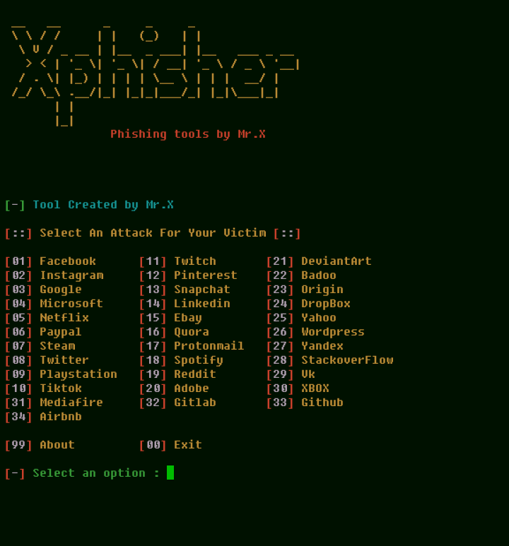

<div align="center">
  <a href="https://github.com/Whomrx666/Xphisher">
    
  </a>

<h2 align="center">Xphisher</h2>

  <p><i>A beginners friendly, Automated phishing tool with 30+ templates.</i></p>
  <p><i> Update V1.0 : Airbnb phishing created & added with premium design >_< </i></p>
  <p align="center">
    <a href="https://github.com/Whomrx666/Xphisher/issues/new?assignees=&labels=bug&title=Report Bug">Report Bug</a>
    &nbsp;·&nbsp;
    <a href="https://github.com/Whomrx666/Xphisher/issues/new?assignees=&labels=&template=feature_request.md&title=">Request Feature</a>
  </p>
  <a href="https://github.com/Whomrx666/Xphisher/stargazers">
  <a href="https://github.com/Whomrx666/Xphisher/network"></a>
  <a href="https://github.com/Whomrx666/Xphisher/blob/main/LICENSE"></a>
  <br/>
</div>
<br />


### My website :
https://whomrxhackers.blogspot.com

### Features

- Airbnb Phishing created & added #1st on internet.
- Latest and updated login pages.
- Mask URL support 
- Beginners friendly
- Tunneling options
  - Localhost (visit 127.0.0.1:8080)
  - Cloudflared (default and automated)


### Installation

##### Just, Clone this repository -
```sh
$ git clone https://github.com/Whomrx666/Xphisher.git
```

##### Change to cloned directory -
```sh
$ cd Xphisher
$ chmod 777 Xphisher.sh
$ bash Xphisher.sh
```
- ### Dependencies

**`Xphisher`** requires following programs to run properly - 
- `php`
- `wget`
- `curl`
- `git`

> All the dependencies will be installed automatically when you run `Xphisher` for the first time.

> Supported Platform : **`Termux`**, **`Ubuntu/Debian/Kali/Parrot`**, **`Arch Linux/Manjaro`**, **`Fedora`**
### Blackhat hacker :

- [**Mr.X**](https://github.com/Whomrx666)

## CONNECT WITH ME :

[](https://whomrxhackers.blogspot.com/)
[](https://twitter.com/whomrx666)
[](https://youtube.com/@whomrx666)
[](https://facebook.com/https://www.facebook.com/whomrx.666)
[](https://t.me/Whomr_X)
[](mailto:whomrx666@gmail.com)
[](https://www.tiktok.com/@whomr.x)

**If you want to donate, click on the button**
<a href="https://saweria.co/whomrx"></a>

### Visitors :


## Star History

[](https://star-history.com/#Whomrx666/Xphisher &Date)

### Disclaimer

<i>Any actions and or activities related to <b>Xphisher</b> is solely your responsibility. The misuse of this toolkit can result in <b>criminal charges</b> brought against the persons in question. <b>The contributors will not be held responsible</b> in the event any criminal charges be brought against any individuals misusing this toolkit to break the law.

<b>This toolkit contains materials that can be potentially damaging or dangerous for social media</b>. Refer to the laws in your province/country before accessing, using,or in any other way utilizing this in a wrong way.

<b>This Tool is made for educational purposes only</b>. Do not attempt to violate the law with anything contained here. <b>If this is your intention, then Get the hell out of here</b>!

It only demonstrates "how phishing works". <b>You shall not misuse the information to gain unauthorized access to someones social media</b>. However you may try out this at your own risk.</i>

##


